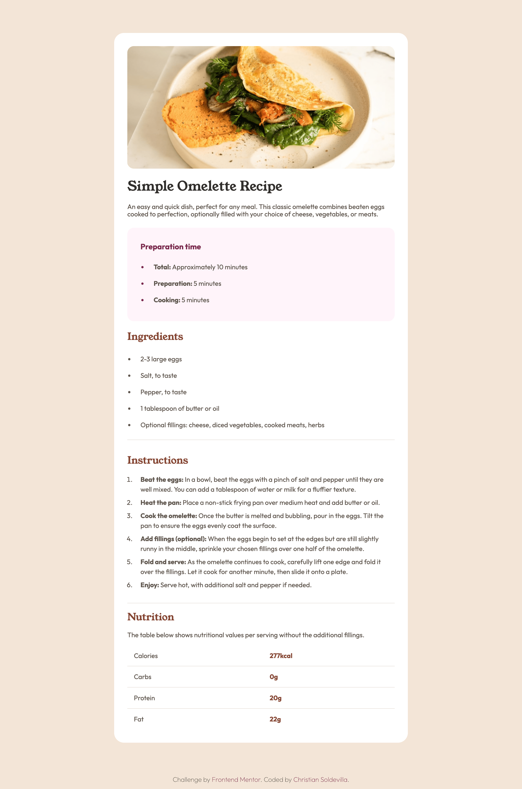
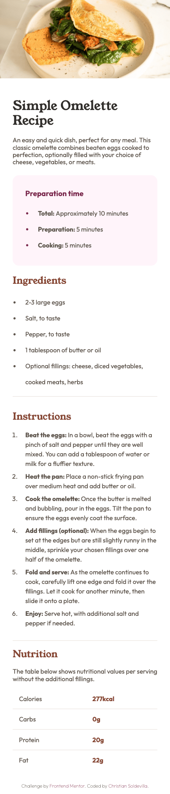

# Frontend Mentor - Recipe page solution

This is a solution to the [Recipe page challenge on Frontend Mentor](https://www.frontendmentor.io/challenges/recipe-page-KiTsR8QQKm). Frontend Mentor challenges help you improve your coding skills by building realistic projects. 

## Table of contents

- [Overview](#overview)
  - [The challenge](#the-challenge)
  - [Screenshot](#screenshot)
  - [Links](#links)
- [My process](#my-process)
  - [Built with](#built-with)

## Overview
This challenge will help you focus on writing semantic HTML. Ensure you think through what HTML elements are most appropriate for each piece of content.

### Screenshot

### Links

- Solution URL: [github.com/soldochris/recipe-page](https://github.com/soldochris/recipe-page)
- Live Site URL: [soldochris.github.io/recipe-page](https://soldochris.github.io/recipe-page/)

## My process

### Built with

- Semantic HTML5 markup
- CSS custom properties